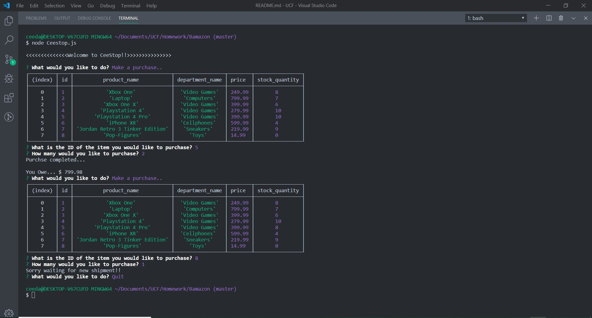

# Bamazon

1. The app will prompt users with two messages.

   * The first will ask them the ID of the product they would like to buy.
   * The second message will ask how many units of the product they would like to buy.

2.  Once the customer has placed the order, the application will check if the store has enough of the product to meet the customer's request.

   * If not, the app will log the phrase  `Sorry waiting for new shipment!!`, and then prevent the order from going through.

3.  However, if the store _does_ have enough of the product, the store will fulfill the customer's order.

   * Once the update goes through, it will show the customer the total cost of their purchase.